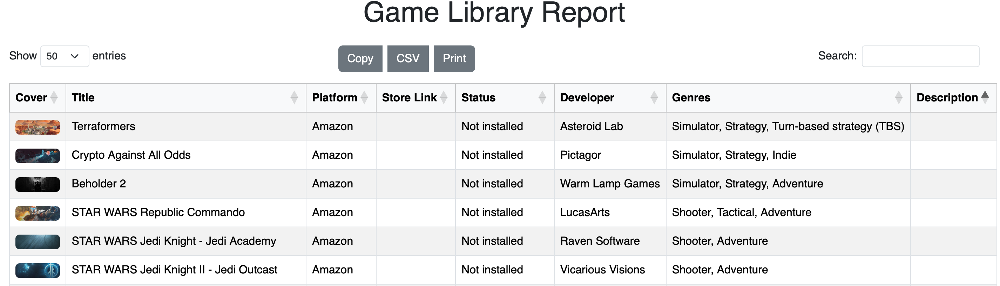

# Heroic + Steam Game Library Report

Generate an **interactive HTML report** and **CSV export** of your game library from:

- **Heroic** (GOG, Epic, Amazon)
- **Steam** (via public profile)

The reports include:
- Title, developer, genres, description
- Platform/store (GOG, Epic, Amazon, Steam)
- Install status and native platform info (Mac/Linux)



---

## Requirements

- Python 3.7+
- `requests` library (`pip install requests`)

---

## Setup

### 1. Heroic

Log into your GOG, Epic, and Amazon accounts using the Heroic Launcher.

Make sure these files exist in your Heroic config directory:

| OS      | Path |
|---------|------|
| macOS   | `~/Library/Application Support/heroic/store_cache` |
| Linux   | `~/.config/heroic/store_cache` |
| Windows | `C:\Users\<you>\AppData\Roaming\heroic\store_cache` |

Files used:
- `gog_library.json`
- `legendary_library.json`
- `nile_library.json`

You can override the path using `--store-cache` when running the script.

### 2. Steam

- Make sure your Steam profile is set to **public**
- Get your **custom profile ID** (from the URL `https://steamcommunity.com/id/<your_id>`)
- Use it with the `--steam-user` flag

---

## Usage

### Generate HTML Report (Interactive Table)
```bash
# For HTML
python3 game_report_html.py --steam-user YOUR_STEAM_ID
# Additional options:
python3 game_report_html.py \
  --steam-user your_steam_id \
  --store-cache "/custom/path/to/heroic/store_cache" \
  --output "my_custom_report.html"


python3 game_report_csv.py --steam-user YOUR_STEAM_ID
```

